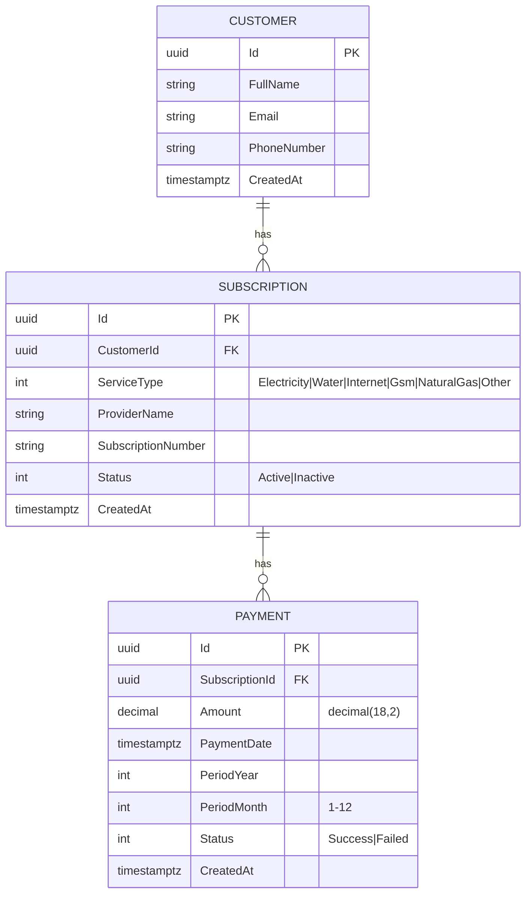
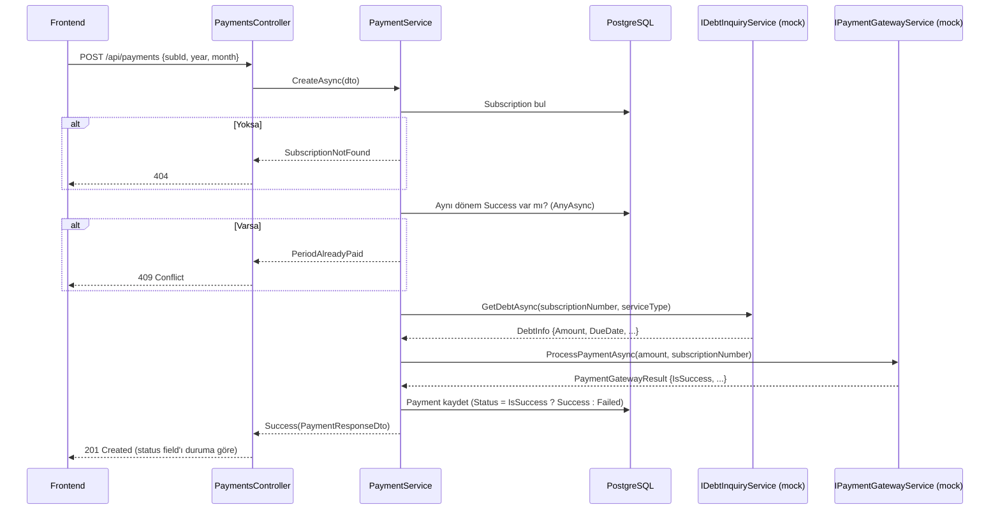

# Subscription Tracker

Bankacılık case study: müşterilerin elektrik, su, internet, GSM gibi aboneliklerini sisteme tanıtıp borç sorgulayabildiği ve mock bir ödeme gateway'i üzerinden ödeme yapabildiği basit bir REST API + tek sayfa frontend uygulaması.

---

## 1. Proje Tanımı

Subscription Tracker, abonelik bazlı periyodik ödemeleri takip etmek için tasarlanmış sade bir uygulamadır. Müşteri kaydı, abonelik yönetimi (CRUD), 3rd-party borç sorgulama mock servisi ve %90 başarı oranlı mock ödeme gateway'ini içerir. Aynı dönem (yıl + ay) için ikinci bir başarılı ödemeyi engelleyen iş kuralı service katmanında zorlanır. Backend .NET 10 + Entity Framework Core + PostgreSQL üzerinde, frontend ise tek bir HTML dosyası içinde vanilla JS + Tailwind CDN ile çalışır.

---

## 2. Teknoloji Seçimleri ve Gerekçeleri

| Katman | Tercih | Gerekçe |
|---|---|---|
| Runtime | **.NET 10** | Sistemde kurulu en güncel sürüm; case için yeterli. |
| Web framework | **ASP.NET Core Web API (Controllers)** | Minimal API yerine Controllers — sınırların ve dependency injection'ın daha açık görünmesi için. |
| ORM | **EF Core 10 + Npgsql** | PostgreSQL ile native uyum; LINQ ile okunabilir sorgular. |
| Şema | **`EnsureCreated()`** | Migration zinciri yok, sunum için tek seferde tablolar oluşur. |
| API dokümantasyonu | **Swashbuckle (Swagger UI)** | .NET 10'un built-in OpenAPI'si yalnız spec dosyası serve ediyor; sunumda gezilebilir bir UI gerekiyordu. |
| Frontend | **Tek `index.html` + Vanilla JS + Tailwind CDN** | Build adımı yok, kurulumda Node gerektirmiyor, kod açık. |
| Para tipi | **`decimal(18,2)`** | Finansal hesaplarda `double`/`float` asla kullanılmaz. |
| Tarih | **`DateTime` UTC + `timestamptz`** | TZ tutarlılığı; Npgsql'in modern davranışıyla uyumlu. |
| JSON | **System.Text.Json + `JsonStringEnumConverter`** | Default serializer; enum'lar sayı yerine string olarak görünür (örn. `"Success"`). |

### Bilinçli olarak **kullanılmayanlar**
- AutoMapper, MediatR, FluentValidation, CQRS, Repository pattern, EF Migrations, Authentication, Docker, React/Vue.

Sebep: case süresi kısa, kod review edilebilirlik öncelikli. Manuel mapping (4-6 satır), Data Annotations validasyonu ve doğrudan DbContext kullanımı tercih edildi.

---

## 3. Kurulum & Çalıştırma

### Önkoşullar
- .NET SDK 10.x
- PostgreSQL 17 (lokalde çalışıyor olmalı)

### PostgreSQL hazırlığı
```sql
CREATE USER app_user WITH PASSWORD 'app_pass_123';
CREATE DATABASE subscription_tracker OWNER app_user;
```
> Connection string `appsettings.json` içinde tanımlı:
> `Host=localhost;Port=5432;Database=subscription_tracker;Username=app_user;Password=app_pass_123`

### Çalıştırma
```bash
git clone <repo>
cd subscription-tracker
dotnet build
dotnet run --project SubscriptionTracker.Api
```

Uygulama açıldığında:
- **Frontend**     → http://localhost:5245/
- **Swagger UI**   → http://localhost:5245/swagger
- **API kökü**     → http://localhost:5245/api/...

> Uygulama ilk kez başladığında `EnsureCreated()` tabloları otomatik oluşturur.

---

## 4. API Endpoint Listesi

| Method | Path | Açıklama | Olası status code'lar |
|---|---|---|---|
| POST | `/api/customers` | Müşteri yarat | 201 |
| GET | `/api/customers` | Müşteri listesi | 200 |
| GET | `/api/customers/{id}` | Müşteri detayı | 200, 404 |
| DELETE | `/api/customers/{id}` | Müşteri sil (cascade) | 204, 404 |
| GET | `/api/customers/{id}/summary` | Aktif abonelik + bu ay ödenmemişler + son 10 ödeme | 200, 404 |
| POST | `/api/subscriptions` | Abonelik yarat | 201, 404 |
| GET | `/api/subscriptions?customerId=` | Abonelik listesi (filtreli) | 200 |
| GET | `/api/subscriptions/{id}` | Abonelik detayı | 200, 404 |
| PUT | `/api/subscriptions/{id}` | Abonelik güncelle | 200, 404 |
| DELETE | `/api/subscriptions/{id}` | Abonelik sil (cascade) | 204, 404 |
| GET | `/api/subscriptions/{id}/debt-inquiry` | Mock borç sorgulama | 200, 404 |
| POST | `/api/payments` | Ödeme yap (3 dış servisle akış) | 201, 404, **409** |
| GET | `/api/payments?subscriptionId=&customerId=` | Ödeme listesi | 200 |
| GET | `/api/payments/{id}` | Ödeme detayı | 200, 404 |

> 201 her zaman ödeme **kaydının** oluştuğunu gösterir; gateway başarısız olduysa response body'de `"status": "Failed"` döner. 409 ise aynı dönem için zaten Success kaydı olduğunu belirtir.

---

## 5. Veri Modeli & ER Diagram



**İlişkiler**
- `Customer 1—N Subscription` — `OnDelete(Cascade)`
- `Subscription 1—N Payment` — `OnDelete(Cascade)`

**Kritik iş kuralı**
> Aynı `(SubscriptionId, PeriodYear, PeriodMonth)` için yalnızca bir Payment'ın `Status = Success` olabilir. Bu kural DB index ile değil, `PaymentService.CreateAsync` içinde explicit `AnyAsync` check ile zorlanır. Gerekçe: business kuralının nerede yaşadığını okur okumaz görmek.

---

## 6. Ödeme Akışı



> Gateway başarısız olsa bile Payment **audit kaydı için** yazılır. Aynı dönem için tekrar denenebilir; Failed kayıtları 409'u tetiklemez.

---

## 7. Mimari Kararlar

### Tek proje, klasör tabanlı katman
`SubscriptionTracker.Api/` altında `Controllers/`, `Services/`, `Services/External/`, `Models/Entities/`, `Models/Dtos/`, `Data/`, `Middleware/`, `wwwroot/`. Solution birden fazla projeye bölünmedi — review/sunum için dolaşılan dosya sayısını azaltıyor.

### Service'lerde exception yok, "Result" pattern var
Çok-sonuçlu operasyonlar (`PaymentService.CreateAsync`) için exception fırlatmak yerine `PaymentCreateOutcome` enum + record döndürülür. Controller bunu `switch expression` ile HTTP koduna çevirir. Tek-sonuçlu "not found" durumları nullable return ile gösterilir. Sebep: try-catch'i her yere serpiştirmemek.

### DbContext doğrudan service'lerde
Repository pattern eklenmedi. `_db.Customers.FindAsync()` doğrudan service içinde. Bu küçük projede ekstra abstraction layer fayda yerine maliyet getirir.

### Manuel mapping
Her service'in altında `private static ToDto(...)` metodu var. AutoMapper yok. 6-10 satırlık explicit kod tüm reviewer'lar için anlaşılır.

### Global ExceptionHandlerMiddleware
Tüm beklenmedik hatalar pipeline'ın en üstündeki middleware'de yakalanır, tek tip JSON response döner (`{ error, detail }`). Service'ler ve controller'lar try-catch'le dolu değil.

### Mock 3rd-party servisler `IDebtInquiryService` ve `IPaymentGatewayService` interface'leri arkasında
`MockDebtInquiryService` (random 50-500 TL, 200-500ms gecikme) ve `MockPaymentGatewayService` (%90 başarı, 300-800ms gecikme). Üretime geçişte sadece DI registration değişir, hiçbir business kodu etkilenmez.

### Frontend tek dosyada
Build adımı yok, Node gerekmiyor. Sayfa yüklendiğinde 3 sekmeli arayüz vanilla JS ile fetch çağrıları yapar. Tailwind CDN üzerinden çekilir.

---

## 8. AI Kullanımı

Bu projede yapay zeka destekli geliştirme yaklaşımı bilinçli ve kontrollü şekilde uygulanmıştır.

### Kullanılan Araç
- **Claude Code** (Anthropic, Sonnet 4.6 modeli) — pair programming yaklaşımıyla

### Nasıl Kontrol Ettim

Projenin başında bir rehber doküman (CLAUDE.md) oluşturarak AI'a çalışma kuralları verdim:
- Kullanılacak ve kullanılmayacak teknolojileri önceden belirledim
- Her aşamada önce plan sunmasını, onay almadan kod yazmamasını istedim
- Domain modelini, API endpoint'lerini ve klasör yapısını ben tasarladım
- Build başarısız olursa devam etmemesini kurallaştırdım

### Aşamalı Geliştirme

Proje 4 aşamada geliştirildi:

| Aşama | İçerik | Kontrol Noktası |
|-------|--------|-----------------|
| 1 | Proje iskeleti + Entity'ler + DbContext | dotnet build ✅, tablo yapısını PostgreSQL'de doğruladım |
| 2 | DTO'lar + Service'ler + Controller'lar | dotnet build ✅, Swagger UI'da tüm endpoint'leri test ettim |
| 3 | Mock servisler + Ödeme akışı + Özet endpoint | dotnet build ✅, ödeme akışını uçtan uca test ettim (başarılı, başarısız, tekrar ödeme engeli) |
| 4 | Frontend + Middleware + README | dotnet build + run ✅, frontend'den tam demo akışı gerçekleştirdim |

### AI Çıktılarını Nasıl Kontrol Ettim

Her aşamada AI'ın ürettiği kodu şu şekillerde gözden geçirdim:

- **Derleme kontrolü:** Her aşama sonunda `dotnet build` çalıştırıldı, hatasız derleme doğrulandı
- **Çalışma zamanı testi:** `dotnet run` ile uygulamayı ayağa kaldırıp Swagger UI üzerinden her endpoint'i manuel test ettim
- **Frontend doğrulaması:** Tarayıcıda müşteri oluşturma → abonelik ekleme → borç sorgulama → ödeme yapma → tekrar ödeme engeli → müşteri özeti akışını baştan sona test ettim
- **Uç durum kontrolü:** Aynı dönem tekrar ödeme (409), olmayan müşteri/abonelik (404), gateway başarısızlığı (201 + Failed status) senaryolarını doğruladım
- **Kod incelemesi:** Özellikle PaymentService'teki ödeme akışını satır satır inceledim — borç sorgulama → gateway → kaydetme sıralamasının doğruluğunu teyit ettim

### Benim Verdiğim Teknik Kararlar

| Konu | Alternatifler | Benim Kararım | Gerekçe |
|------|--------------|----------------|---------|
| Mimari | Clean Architecture (multi-project) vs tek proje | Tek proje, klasör tabanlı | Proje boyutuna uygun, review edilebilirlik yüksek |
| DB şema yönetimi | EF Migrations vs EnsureCreated | EnsureCreated | Case scope'u için yeterli, gereksiz karmaşıklıktan kaçındım |
| Gateway fail → HTTP kodu | 201 vs 422 | 201 + body'de "Failed" | Kayıt oluştu, RESTful mantığa uygun |
| Period kontrolü | DB index vs service check | Service check | İş kuralının nerede yaşadığı açıkça görülsün |
| Frontend framework | React vs vanilla JS | Vanilla JS + Tailwind CDN | Node kurulumu gerektirmez, build adımı yok |
| Validation | FluentValidation vs Data Annotations | Data Annotations | Ekstra kütüphane yok, basit ve yeterli |
| Mapping | AutoMapper vs manuel | Manuel mapping | Her satır açık, magic yok |
| Error handling | Her yerde try-catch vs global middleware | Global ExceptionHandlerMiddleware | Kod temiz kalır, tek noktada yönetim |

### AI Kullanımında Öğrendiğim Şey

AI'ı "kod yazıcı" olarak değil, "pair programming partneri" olarak kullandım. En değerli katkısı syntax üretmek değil, her aşamada alternatif sunup beni karar vermeye zorlaması oldu. Örneğin Swashbuckle eklenmesi, DateTime-PostgreSQL uyumsuzluğu gibi .NET ekosistemine özgü sorunları AI tespit etti, ben çözüm yönünü onayladım.

---

## 9. Eksikler ve İyileştirme Fikirleri

| Konu | Şu an | İdeal |
|---|---|---|
| Authentication / Authorization | Yok | JWT bearer + per-customer scope |
| EF Migrations | `EnsureCreated()` | Versiyonlanabilir migration zinciri |
| Logging | Default ASP.NET Core | Serilog → Seq / Application Insights |
| Payment audit detayı | Sadece Status saklanıyor | `TransactionId`, `GatewayErrorMessage` da Payment'a eklenmeli |
| Period uniqueness | Service-level check | DB seviyesinde filtered unique index (`WHERE Status = 0`) — race condition koruması |
| Mock servisler | In-process random | Gerçek HTTP client + Polly retry/circuit-breaker |
| Test coverage | Yok | xUnit + Testcontainers (Postgres) ile integration testler |
| Frontend state | Refresh-on-action | Reactive (Vue/Svelte) ya da SignalR push |
| CI/CD | Yok | GitHub Actions: build + test + lint + Docker image |
| Containerization | Yok | Multi-stage Dockerfile + docker-compose (api + postgres) |
| Validation | Data Annotations | FluentValidation + ProblemDetails formatı |
| Concurrency | Yok | EF rowversion ile optimistic concurrency |
| Pagination | Yok | List endpoint'lerine `?page=&pageSize=` |

---

**Geliştirici notu:** Bu proje küçük tutuldu; sunumda gerçek üretim için yapılacaklar madde 9'da. Burada gösterilen şey, kısa süre içinde nasıl temiz, test edilebilir ve genişletilebilir bir backend yapılır — onun iskeleti.
